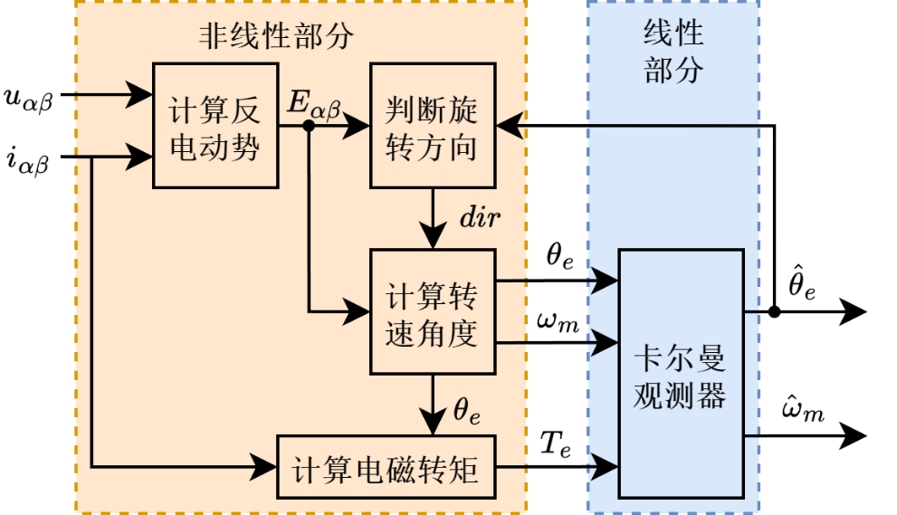
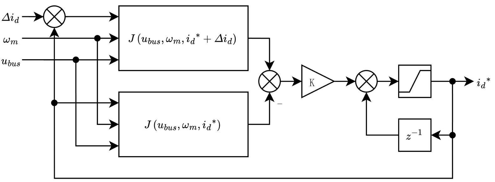
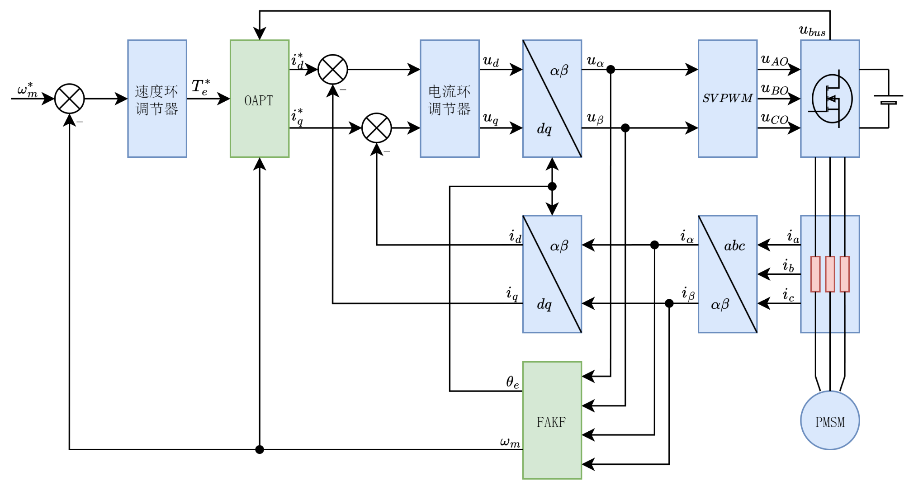

# 永磁同步电机低噪声全速度范围无传感器控制研究：项目技术速览

> 本文档是面向 AF-MDB 项目读者整理的技术说明，重点保留第 3、4、5 章中与项目实现相关的创新思想、核心公式、框图和实验结论。
>
> 原论文中的封面、声明、目录、学校培养信息、绪论综述、参考文献和致谢已删去。完整理论推导、公式编号、文献来源和实验细节请查阅原论文《永磁同步电机低噪声全速度范围无传感器控制研究》，DOI: `10.27759/d.cnki.ggxgx.2024.000640`。

## 阅读线索

这份速览不再按论文格式展开，而是按项目读者最关心的顺序组织：

1. 先理解 PMSM 无传感器控制为什么难：低速反电动势弱、高速电压受限、高频注入有噪声。
2. 再看第 3 章的 FAKF：如何把传统 EKF 拆成“非线性测量提取 + 低阶线性卡尔曼观测”。
3. 再看第 4 章的 OAPT：如何用 d 轴电流同时处理低速稳定、高速弱磁和电池欠压。
4. 最后看第 5 章的工程验证：硬件、软件、联调平台、实物转速跟踪、噪声和运行时间。

## 项目要解决的问题

PMSM 无传感器控制希望不依赖编码器或位置传感器，直接通过电压、电流和电机模型估计转子位置与转速，再完成 FOC 闭环控制。这样可以降低成本、减少线束、提升系统可靠性，但工程上会遇到几个矛盾：

- **低速和零速难**：反电动势幅值随转速下降而变小，模型观测器很难得到可靠角度。
- **高速电压受限**：转速升高后反电动势增大，母线电压不足时 q 轴电压余量变小，转矩能力下降。
- **高频注入有噪声**：传统全速域方案常在低速使用高频注入，中高速切换到观测器法，但高频电压会带来明显电磁声。
- **切换策略复杂**：两种估计方法之间需要融合、切换或权重调度，边界稳定性和参数调试都比较麻烦。
- **嵌入式算力有限**：20 kHz 控制频率下单周期只有 50 us 左右，ADC、观测器、FOC 和 PWM 更新都要在一个周期内完成。

AF-MDB 的算法主线可以概括为：**用快速自适应卡尔曼观测器 FAKF 提高位置/速度估计质量，用最优电流点跟踪 OAPT 改善观测器在零低速和弱磁区的工作条件，从而减少对高频注入和多策略切换的依赖。**

## 第 3 章：FAKF 快速自适应卡尔曼观测器

### 创新思想

传统 EKF 通常直接对 PMSM 的非线性状态方程做局部线性化，状态维度高，雅可比矩阵复杂，实时运行成本较高，而且过程噪声 `Q`、测量噪声 `R` 对调参非常敏感。

FAKF 的关键改动是把非线性环节和卡尔曼滤波环节分开：

1. 先由采样电压、电流计算反电动势。
2. 再由反电动势提取带噪声的角度和速度测量值。
3. 最后只对速度、角度构成的低阶线性系统做卡尔曼融合。
4. 用残差和息差在线估计噪声协方差，使 `Q`、`R` 能随工况变化自适应调整。

### 非线性测量提取

在静止坐标系下，可先由电压方程提取反电动势。工程离散形式可以理解为：

$$
\begin{aligned}
e_{\alpha}(k) &= u_{\alpha}(k) - R_s i_{\alpha}(k) - L_s \frac{i_{\alpha}(k)-i_{\alpha}(k-1)}{T_s} \\
e_{\beta}(k) &= u_{\beta}(k) - R_s i_{\beta}(k) - L_s \frac{i_{\beta}(k)-i_{\beta}(k-1)}{T_s}
\end{aligned}
$$

对表贴式 PMSM，反电动势与电角度、转速近似满足：

$$
\begin{aligned}
e_{\alpha} &= -\omega_e \psi_f \sin\theta_e \\
e_{\beta} &= \omega_e \psi_f \cos\theta_e
\end{aligned}
$$

因此可以从反电动势中得到测量角度和速度：

$$
\begin{aligned}
θ_{e,z} &= \operatorname{atan2}(-e_{\alpha}, e_{\beta}) \\
|\omega_{e,z}| &= \frac{\sqrt{e_{\alpha}^{2}+e_{\beta}^{2}}}{\psi_f}
\end{aligned}
$$

由于反电动势在低速时很弱，这一步得到的是“带噪声的测量值”，不是最终估计值。FAKF 的作用就是把这些测量值和机械运动模型融合起来。

电磁转矩作为观测器输入，常用表达为：

$$
T_e = 1.5p\left[\psi_f i_q + (L_d-L_q)i_d i_q\right]
$$

对于表贴式 PMSM，`L_d` 与 `L_q` 接近，上式常简化为：

$$
T_e \approx 1.5p\psi_f i_q
$$

### 低阶线性观测器

FAKF 只把机械速度和电角度作为核心状态：

$$
\begin{aligned}
x_k &= [\omega_m,\ \theta_e]^T \\
u_k &= T_e \\
z_k &= [\omega_{m,z},\ \theta_{e,z}]^T
\end{aligned}
$$

离散机械模型可写成线性状态空间形式：

$$
\begin{aligned}
x_k &= A x_{k-1} + B u_k + w_k \\
z_k &= H x_k + v_k
\end{aligned}
$$

其中 `w_k` 是过程噪声，主要吸收负载扰动、模型不准和未建模动态；`v_k` 是测量噪声，主要来自反电动势提取、电流采样和数值微分。相比传统 4 阶非线性 EKF，这个观测器的矩阵维度更小，状态转移矩阵更简单，更适合放进 STM32H7 的高速控制周期。

### 卡尔曼更新过程

FAKF 的滤波核心仍然遵循标准离散卡尔曼预测与校正：

$$
\begin{aligned}
x_k^- &= A x_{k-1} + B u_k \\
P_k^- &= A P_{k-1} A^T + Q_k \\
K_k &= P_k^- H^T\left(H P_k^- H^T + R_k\right)^{-1} \\
x_k &= x_k^- + K_k\left(z_k - Hx_k^-\right) \\
P_k &= \left(I-K_kH\right)P_k^-
\end{aligned}
$$

这里 `K_k` 是卡尔曼增益，`P_k` 是估计协方差。传统 EKF 的难点在于 `Q`、`R` 难以固定整定：转速、采样噪声、负载扰动变化后，原先好用的噪声矩阵可能变得不匹配。

### Q/R 自适应思想

论文中引入两个误差信号：

$$
\begin{aligned}
r_k &= z_k - Hx_k^- \\
d_k &= z_k - z_k^-
\end{aligned}
$$

其中 $r_k$ 为残差，表示测量值与当前预测值之间的偏差；$d_k$ 为息差，表示新的测量值与基于上一时刻信息预测测量值之间的偏差。

然后在线估计残差和息差的协方差：

$$
\begin{aligned}
C_r(k) &= \operatorname{cov}(r_k) \\
C_d(k) &= \operatorname{cov}(d_k)
\end{aligned}
$$

直觉上：

- 残差的统计强度反映“测量噪声和预测不一致”的程度。
- 息差的统计强度可以帮助区分过程噪声和测量噪声。
- 当估计协方差与理论协方差不匹配时，说明当前 `Q_k` 或 `R_k` 需要调整。

为了避免直接做矩阵减法导致协方差矩阵失去正定性，论文采用合同变换思想修正 `Q`、`R`。工程上可以理解为：

$$
\begin{aligned}
Q_{k+1} &= \operatorname{adapt}\left(Q_k, C_d, C_{d,\mathrm{theory}}\right) \\
R_{k+1} &= \operatorname{adapt}\left(R_k, C_r, C_{r,\mathrm{theory}}\right)
\end{aligned}
$$

其中自适应律带有收敛系数，用来控制噪声矩阵调整速度。这样 FAKF 不必长期依赖一组固定噪声参数，能够随转速变化、扰动和采样噪声变化调整滤波权重。

### 最终效果

FAKF 的效果主要体现在三点：

- 在全速阶跃、低速突加负载、高速突加负载、正弦加减速等仿真中，速度和角度能较好跟随真实值。
- 与传统 EKF 相比，FAKF 避免了高阶非线性矩阵运算，降低了实时计算成本。
- 自适应噪声矩阵使观测器在不同转速段能保持更稳定的误差特性。

## 第 4 章：OAPT 最优电流点跟踪

### 创新思想

FAKF 虽然降低了 EKF 的计算量并提高了中高速观测质量，但接近零速时反电动势仍然趋近于零，仅靠反电动势观测很容易角度不收敛。传统办法是低速高频注入，中高速观测器法，再做切换。OAPT 的思路不同：**它不额外估计角度，而是通过 d 轴电流改变电机工作点，让同一个观测器在零低速、高速和欠压时都更容易工作。**

### d 轴电流的三个作用

在表贴式 PMSM 中，d 轴电流几乎不产生主要转矩，但它会影响三个关键指标：

1. **角度稳定性**：低速时正向 d 轴电流能让角度误差形成更有利的负反馈。
2. **效率与发热**：d 轴电流越大，铜损和无功功率越大。
3. **电压余量**：高速或欠压时负向 d 轴电流可弱磁，降低反电动势，为 q 轴控制保留电压空间。

在论文采用的符号约定下，角度误差 $\Delta\theta$ 存在时，d 轴电流会产生一个与误差相关的转矩项，可概括为：

$$
T_d \approx 1.5p\psi_f i_d \sin(\Delta\theta)
$$

当 `i_d` 的方向选择合适时，这个转矩项会帮助角度误差收敛；方向相反时，可能形成正反馈并放大误差。这也是 OAPT 在低速选择正向 d 轴电流的核心原因。

### 综合性能指标

OAPT 将“低速稳定、效率、高速电压余量”统一成一个性能指标函数。工程理解可写为：

$$
J(i_d, \omega_m, U_{dc}) = L J_{\mathrm{stable}} + M J_{\mathrm{loss}} + N J_{\mathrm{voltage}}
$$

其中：

- `J_stable` 描述低速角度稳定性需求。
- `J_loss` 描述 d 轴电流带来的发热和无功功率损失。
- `J_voltage` 描述高速或欠压时的电压余量。
- `L`、`M`、`N` 是权重，可根据应用偏向低速稳定、效率或高速性能。

最终控制目标是找到当前转速和母线电压下的最优 d 轴电流：

$$
i_d^{\ast} = \arg\min_{i_d} J(i_d, \omega_m, U_{dc})
$$

论文没有把这个问题做成重计算量的解析求解，而是使用梯度下降思想在线跟踪最优点：

$$
\frac{\partial J}{\partial i_d} \approx \frac{J(i_d + \Delta i, \omega_m, U_{dc}) - J(i_d, \omega_m, U_{dc})}{\Delta i}
$$

$$
i_d^{\ast}(k+1)=\operatorname{sat}\left[i_d^{\ast}(k)-\eta\frac{\partial J}{\partial i_d}\right]
$$

`eta` 是学习率，`sat[]` 用来限制电流范围。这样算法可以在控制周期内轻量运行，不需要复杂求导或查大表。

### FAKF + OAPT 的组合方式

FAKF 和 OAPT 位于控制系统的不同位置：

- FAKF 负责估计转速和角度。
- OAPT 负责给出当前工况下更合适的 d 轴电流目标。
- 两者同时工作，不需要像“高频注入 + 观测器法”那样设计切换边界。

### 最终效果

OAPT 的意义不是单纯“弱磁”，而是把低速启动、高速弱磁和欠压补偿放到同一套电流分配逻辑里：

- 零低速时通过正向 d 轴电流改善角度收敛，减少启动反转。
- 中速时尽量减小无效 d 轴电流，兼顾效率。
- 高速或母线电压不足时自动偏向弱磁，保证 q 轴电压余量。
- 不使用高频注入，因此可避免高频注入带来的尖锐运行噪声。

## 第 5 章：实验平台与实物验证

### 硬件平台

论文实验平台围绕 STM32H7 系列主控设计，硬件包含电源保护与 DCDC、MCU 最小系统、下载调试、三相逆变器、电流采样、编码器/Hall 接口和通信接口等模块。驱动器参数包括 20 kHz 控制频率、ADC 采样、电流采样和 PWM 死区配置等，目标是让算法能在真实功率驱动条件下闭环运行。

### 软件与仿真

软件按层次划分为底层驱动、算法层和应用层。Simulink/Embedded Coder 负责生成 FOC、FAKF、OAPT 等算法代码；STM32CubeIDE 工程负责外设初始化、中断调度、ADC/PWM/通信和保护逻辑。

### 实物联调平台

实验采用双电机对拖平台：一台电机作为被控电机，另一台电机作为负载电机，通过负载电阻模拟风机、泵类负载特性。这样可以验证算法在带载、正反转、低速、高速和动态变速下的实际表现。

### 实物实验结果

论文中重点验证了四类结果：

| 测试项目 | 结果摘要 |
| --- | --- |
| 高低速正反转带载 | 从 5% 额定转速加速到 95% 额定转速，用时小于 0.03 s；稳态速度误差小于 1%。 |
| 动态转速跟踪 | 50 Hz 转速激励下仍能稳定跟随，角度误差保持在可收敛范围内。 |
| 运行噪声 | 相比高频注入法，实验中运行噪声平均降低约 1.86 dB。 |
| 算法耗时 | STM32H723 上 FAKF 总耗时约 28.3 us，传统 EKF 约 44.7 us，减少约 16.4 us。 |

### 工程结论

综合仿真和实物实验，FAKF + OAPT 的价值主要是：

1. 在不使用位置传感器的情况下覆盖零速、低速、中高速、正反转和带载工况。
2. 用 OAPT 替代高频注入的低速稳定作用，降低运行噪声。
3. 用低阶观测器和自适应噪声矩阵降低 EKF 的计算压力和调参压力。
4. 在 STM32H7 + 20 kHz 控制频率下保留实时裕度，便于工程移植。

## 与 AF-MDB 仓库的关系

| 目标 | 路径 | 说明 |
| --- | --- | --- |
| 固件工程 | `2.Software/MDB-V4.1/` | 当前推荐的 STM32CubeIDE 主线工程。 |
| 仿真工程 | `3.Simulation/AFMCS.prj` | MATLAB 项目入口。 |
| 控制仿真 | `3.Simulation/model/Simulation/PMSM_FOC_sensorless.slx` | PMSM 无传感器 FOC 仿真模型。 |
| 代码生成入口 | `3.Simulation/model/Simulation/ModelRef/FOC.slx` | 用于 Embedded Coder 生成嵌入式算法代码。 |
| 生成代码 | `3.Simulation/FOC_ert_rtw/` | 固件工程直接引用的算法 C 代码。 |
| 硬件资料 | `1.Hardware/` | 原理图导出、引脚映射和历史版本硬件资料。 |

如果你想复现或继续开发，建议先从 `3.Simulation/model/Simulation/ModelRef/FOC.slx` 和 `3.Simulation/model/Simulation/PMSM_FOC_sensorless.slx` 理解算法，再看 `2.Software/MDB-V4.1/` 中如何把生成代码接入 ADC、PWM、编码器、Hall 和通信任务。

## 适用边界与注意事项

- OAPT 会在低速阶段引入 d 轴电流来换取角度稳定性，因此效率不是唯一目标；若目标是极限低功耗，需要重新调整性能指标权重。
- 文档中的公式采用工程化表达，省略了论文中的部分符号定义、严格推导和稳定性证明；完整推导请查阅原论文。
- 实物结果与电机参数、母线电压、电流采样噪声、控制频率、机械负载和保护策略有关，移植到其他电机前需要重新整定和验证。
- 本项目涉及功率电子和高速电机控制，首次上电必须限流，并确认采样零点、PWM 死区、保护阈值和急停措施。

## 引用

如果这份项目资料或算法思路对你的研究和开发有帮助，可以引用原论文：

> 《永磁同步电机低噪声全速度范围无传感器控制研究》
> DOI: `10.27759/d.cnki.ggxgx.2024.000640`
