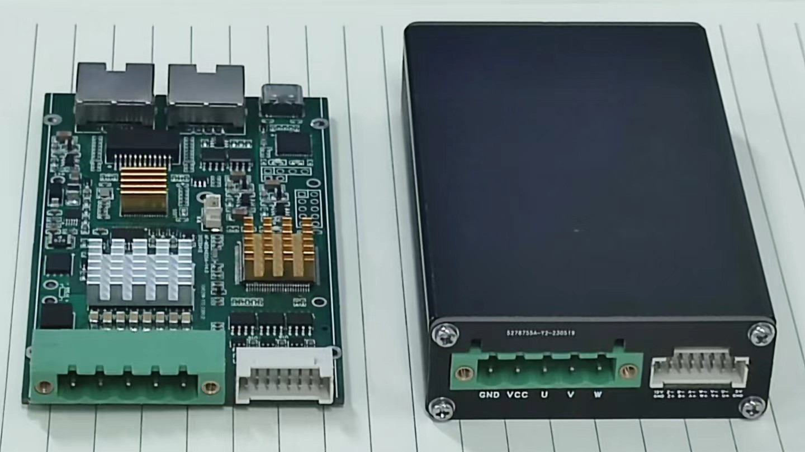
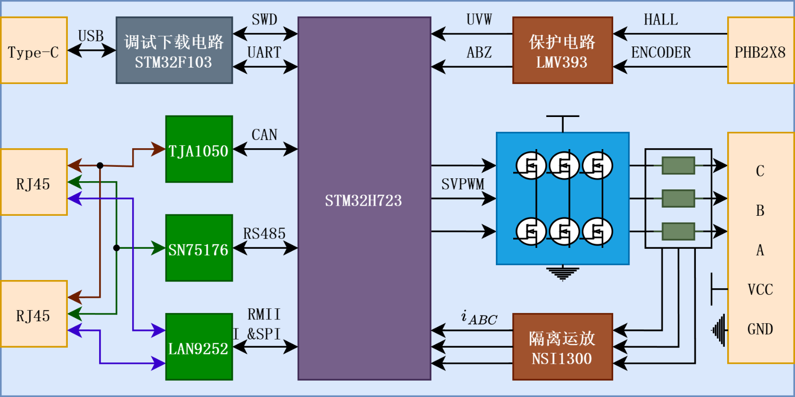
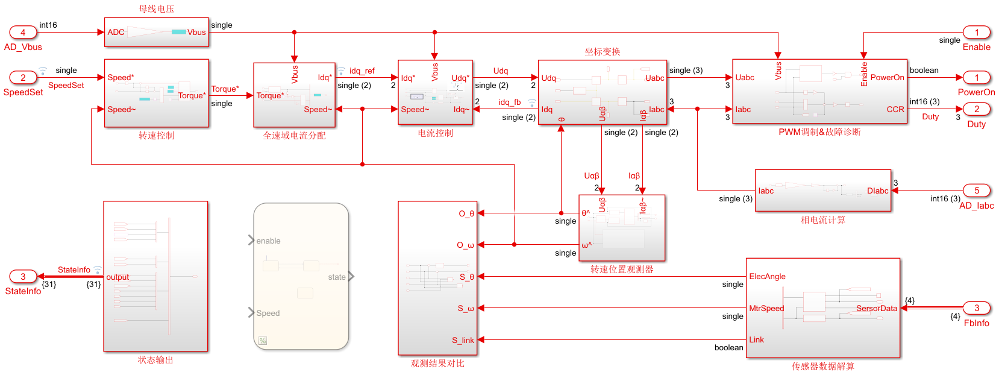
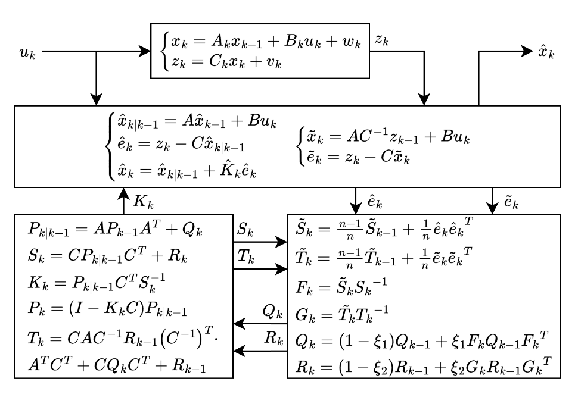
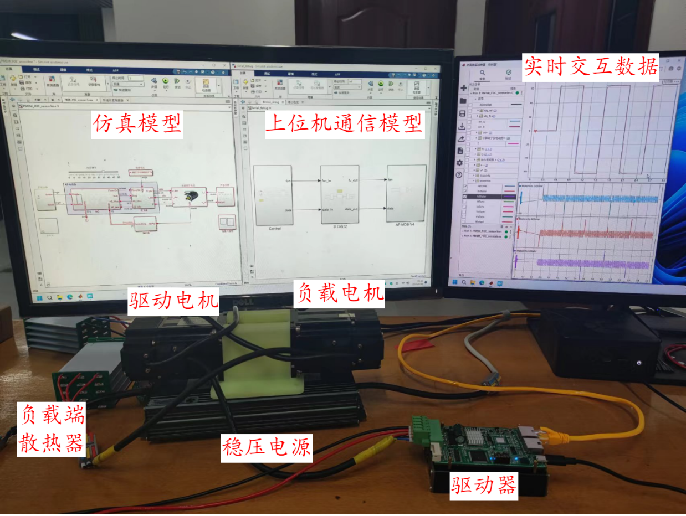
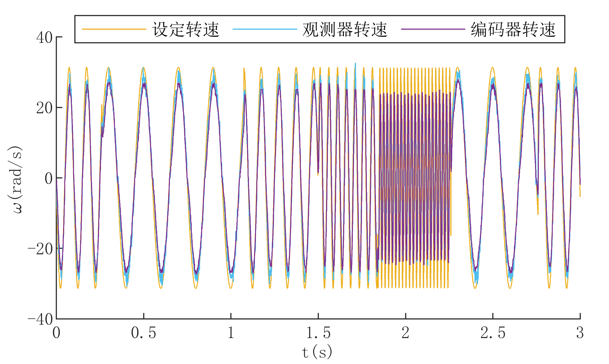

# AF-MDB

AF-MDB (AF Motor Development Board) 是一个基于 STM32H7 的 PMSM/BLDC 电机控制开发板与对拖实验平台，包含硬件原理图、STM32 固件、MATLAB/Simulink 仿真模型和由 Simulink Embedded Coder 生成的 FOC 算法代码。

## 项目图览

<table>
	<tr>
		<td align="center" width="50%">
			 
			<strong>驱动器实物</strong>
		</td>
		<td align="center" width="50%">
			 
			<strong>硬件设计框图</strong>
		</td>
	</tr>
	<tr>
		<td align="center" width="50%">
			 
			<strong>Simulink 控制仿真图</strong>
		</td>
		<td align="center" width="50%">
			 
			<strong>自适应卡尔曼观测器</strong>
		</td>
	</tr>
	<tr>
		<td align="center" width="50%">
			 
			<strong>双电机对拖联调平台</strong>
		</td>
		<td align="center" width="50%">
			 
			<strong>实物转速动态跟踪曲线</strong>
		</td>
	</tr>
</table>

## 算法与实验亮点

AF-MDB 的核心目标是在不使用位置传感器、尽量避免高频注入噪声的情况下，实现 PMSM 全速度范围控制。项目中的两个关键思路是：

- **FAKF 快速自适应卡尔曼观测器**：先由电压、电流计算反电动势，再从反电动势提取带噪声的速度和角度测量值，最后用低阶线性卡尔曼观测器融合机械模型。相比直接对 PMSM 非线性模型做 EKF，FAKF 降低了矩阵运算量，并通过残差、息差自适应调整 `Q/R` 噪声协方差。
- **OAPT 最优电流点跟踪**：把低速角度稳定、d 轴电流损耗和高速电压余量合成为性能指标 $J(i_d, \omega_m, U_{dc})$，在线跟踪 $i_d^{\ast}=\arg\min J$。低速时用正向 d 轴电流帮助角度收敛，高速或欠压时转入弱磁，减少高频注入和策略切换。

实物实验在双电机对拖平台上完成，结果表明：从 5% 额定转速加速到 95% 额定转速用时小于 0.03 s，额定转速下速度波动小于 1%，转速环带宽可达 50 Hz；相比高频注入法，实验中运行噪声降低约 1.86 dB；在 STM32H723 上 FAKF 算法耗时约 28.3 us，比传统 EKF 少约 16.4 us。

## 仓库内容

- `1.Hardware/`：硬件说明、引脚映射、各版本原理图导出文件和必要设计资料。完整在线原理图、PCB 和硬件工程以 OSHWHub 页面为准。
- `2.Software/`：STM32CubeIDE 固件工程。当前主线工程为 `MDB-V4.1`，可直接使用仓库内的 `3.Simulation/FOC_ert_rtw/` 编译，不需要重新生成 Simulink 代码。
- `3.Simulation/`：MATLAB/Simulink 模型、参数脚本、电机参数和驱动参数。主要仿真模型为 `model/Simulation/PMSM_FOC_sensorless.slx`，`model/Simulation/ModelRef/FOC.slx` 用作固件算法引用模型和代码生成入口。
- `4.Doc/`：项目说明、设计文档和研究资料。

## 推荐环境

- STM32CubeIDE 1.19.0：用于导入、配置和编译 `2.Software/MDB-V4.1`。
- STM32CubeMX：随 CubeIDE 使用，用于生成底层外设驱动初始化代码。
- MATLAB/Simulink R2026a：用于打开仿真模型、运行参数脚本，并通过 Embedded Coder 重新生成算法 C 代码。

## 开源范围

当前公开仓库以已发布和可复现的历史版本资料为主。硬件与软件的 V5.0 目录属于本地私有开发资料，不纳入 GitHub 公开仓库；其他版本资料按 `.gitignore` 过滤编译产物、制造输出和本地备份后可推送到云端。

## 快速开始

### 查看硬件

打开 OSHWHub 项目页查看完整硬件工程：

<https://oshwhub.com/xue_jingfei/af-mdb>

Git 仓库中的硬件资料主要用于快速查看原理图、理解接口定义，并与软件和仿真工程对应。若需要打样或修改 PCB，请优先以 OSHWHub 上的最新版工程文件为准。

### 编译固件

1. 安装 STM32CubeIDE 1.19.0。
2. 用 STM32CubeIDE 导入 `2.Software/MDB-V4.1`。
3. 执行 Build Project。

CubeMX 负责底层外设驱动配置和初始化代码生成，FOC 算法代码由 Simulink Embedded Coder 生成。仓库会保留 `3.Simulation/FOC_ert_rtw/`，因此只想编译固件的用户不需要安装 MATLAB/Simulink。若修改 `3.Simulation/model/Simulation/ModelRef/FOC.slx`，则需要重新生成该目录后再编译固件。

### 运行仿真

1. 使用 MATLAB 打开 `3.Simulation/AFMCS.prj`。
2. 运行 `3.Simulation/code/ParameterInit.mlx` 初始化参数。
3. 打开 `3.Simulation/model/Simulation/PMSM_FOC_sensorless.slx` 运行主要控制仿真。
4. 如需重新生成固件算法代码，打开 `3.Simulation/model/Simulation/ModelRef/FOC.slx` 并生成 `FOC_ert_rtw/`。

## 算法说明

`MDB-V4.1` 是当前推荐的主线固件工程。算法模型采用独立引用模型 `3.Simulation/model/Simulation/ModelRef/FOC.slx`，接口和数据类型已按嵌入式代码生成流程配置完成，可直接使用 Embedded Coder 生成 C 语言代码。固件工程直接引用 `3.Simulation/FOC_ert_rtw/` 中的生成代码，并在应用层完成 ADC、编码器、Hall、上位机命令和 PWM 输出之间的适配。

Simulink 算法模型包含作者改进的快速自适应卡尔曼观测器算法和最优电流点跟踪策略，用于 PMSM 全速度范围无传感器控制。建议先阅读 [4.Doc/永磁同步电机低噪声全速度范围无传感器控制研究.md](4.Doc/永磁同步电机低噪声全速度范围无传感器控制研究.md) 了解项目相关的核心思想；完整算法原理、推导和实验结果请查阅论文《永磁同步电机低噪声全速度范围无传感器控制研究》。

## 安全说明

本项目涉及电机驱动、功率电子、电流采样和高速 PWM 控制。复现前请确认供电电压、电流限制、母线电容耐压、过流/过压/欠压保护、散热和急停措施。首次上电建议使用限流电源，并在接入电机前验证采样零点、PWM 死区和保护逻辑。

## 引用

本项目的控制算法来自论文《永磁同步电机低噪声全速度范围无传感器控制研究》。精简版见 [4.Doc/永磁同步电机低噪声全速度范围无传感器控制研究.md](4.Doc/永磁同步电机低噪声全速度范围无传感器控制研究.md)。

如果本项目对你的研究或开发有帮助，可以参考原论文：

> 《永磁同步电机低噪声全速度范围无传感器控制研究》
> DOI: `10.27759/d.cnki.ggxgx.2024.000640`

完整硬件开源页面：<https://oshwhub.com/xue_jingfei/af-mdb>

## 许可证

请以仓库根目录 `LICENSE` 文件和 OSHWHub 项目页面标注为准。若当前副本未包含明确许可证，请在复用或再发布前联系作者确认授权范围。
